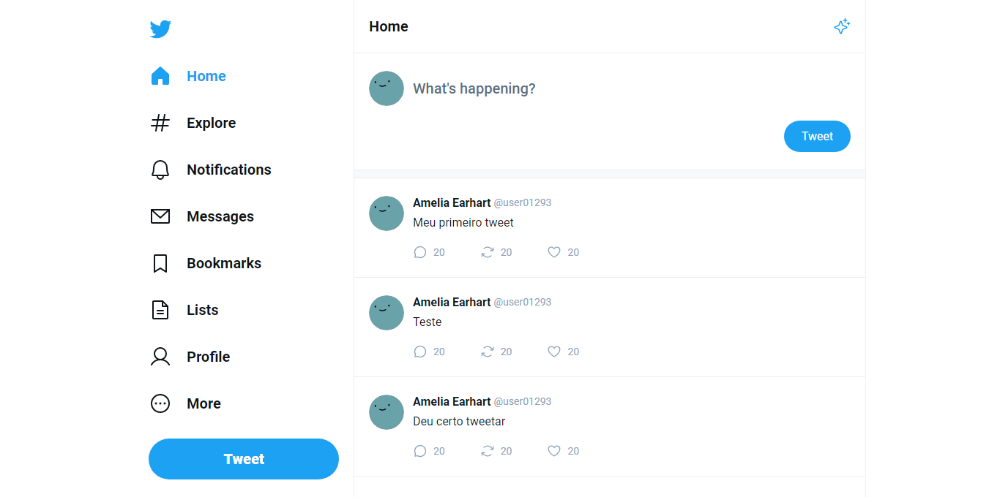
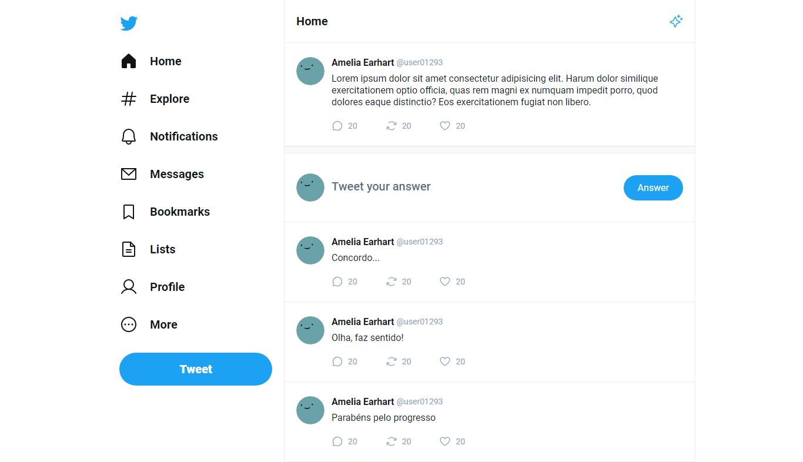

<h1 align="center">Twitter UI</h1>

 

  

  

## 💻 Projeto

Clone da interface do twitter em formato de SPA (Single Page Application) feito com React, para fins de praticar os principais conceitos da biblioteca.

O projeto apresenta uma página principal e uma página de status, que pode ser acessada ao clicar em qualquer tweet.

[Clique aqui](https://twitter-ui-edusmpaio.vercel.app/) para visualizar o projeto no ar.

## 🚀 Tecnologias utilizadas

- [Vite](https://vitejs.dev/)
- [React](https://pt-br.reactjs.org/)
- [React Router](https://reactrouter.com/en/main)
- [TypeScript](https://www.typescriptlang.org/)

## 🖼️ Layout

O layout do projeto encontra-se [nesse link](https://www.figma.com/community/file/1202694130789327431).

É necessário ter uma conta no [Figma](https://figma.com) para ter acesso.
